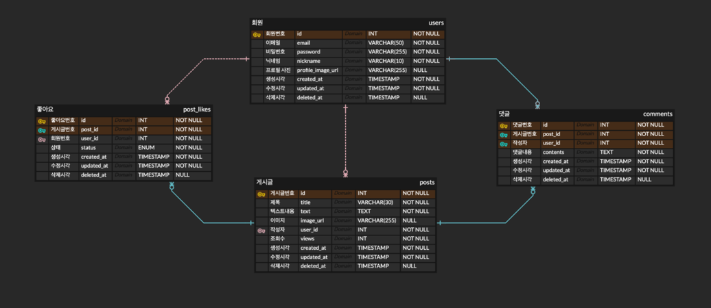

## **프로젝트 개요**

- 제목 : KTB 풀스택 과정 커뮤니티 웹 백엔드
- 소개 : KTB 풀스택 과정 5-7주차 웹 백엔드 개발 과제입니다.

<br>

## **기능 목록**

- 사용자 로그인 및 회원가입
- 게시글 CRUD
- 댓글 CRUD
- 회원정보 수정 기능

<br>

## **기술 스택**

- Spring Boot
- Spring Security
- MySQL

<br>

## **설치 및 실행 방법**

```bash
설치 (터미널)
git clone https://github.com/100-hours-a-week/2-eden-lee-community-be
cd 2-eden-lee-community-be
./gradlew build   # 또는 ./gradlew clean build
./gradlew bootRun
```

<br>

## ERD 설계



<br>

## API 설계
🔗 [API 명세서](https://www.notion.so/API-1b9b43be904c80348460e6142a2eb655)

<br>

## **프로젝트 구조**

```basha
2-eden-lee-community-be/
├── build.gradle
├── settings.gradle
├── README.md
├── uploads            # 이미지 업로드
└── src/
    ├── main/
    │   ├── java/
    │   │   └── com/
    │   │       └── example/
    │   │           └── community/
    │   │               ├── apiPayload/
    │   │               └── config/
    │   │               └── controller/
    │   │               └── converter/
    │   │               └── domain/
    │   │               └── dto/
    │   │               └── repository/
    │   │               └── security/
    │   │               └── service/
    │   │               └── util/
    │   │               └── CommunityApplication.java
    │   └── resources/
    │       ├── application.properties
    │       └── static/
    │       └── templates/
    └── test/
        └── java/
            └── com/
                └── example/
                    └── community/
                        └── CommunityApplicationTests.java

```

<br>

## 고도화 계획

- 이미지 저장 → S3 도입
- 테스트 코드 작성
- CI/CD 구축

<br>

## 회고
🔗 [[CORS] Patch와 Preflight(사전요청)](https://velog.io/@yunju07/CORS-Patch%EC%99%80-Preflight%EC%82%AC%EC%A0%84%EC%9A%94%EC%B2%AD)  

🔗 [트러블 슈팅: 정적 리소스 요청에 대한 401 오류와 딜레이](https://velog.io/@yunju07/%ED%8A%B8%EB%9F%AC%EB%B8%94-%EC%8A%88%ED%8C%85-%EC%A0%95%EC%A0%81-%EB%A6%AC%EC%86%8C%EC%8A%A4-%EC%9A%94%EC%B2%AD%EC%97%90-%EB%8C%80%ED%95%9C-401-%EC%98%A4%EB%A5%98%EC%99%80-%EB%94%9C%EB%A0%88%EC%9D%B4)